# Sistema YPF Ruta - Grupo RayonDeLaCabeza

## YPF Ruta es un sistema que permite a las empresas centralizar el pago y el control de gasto de combustible para su flota de vehículos.

---

## Contenidos

-   [Integrantes](#integrantes)
-   [Correr el programa](#correr-el-programa)
-   [Tests](#tests)
-   [Arquitectura del Sistema](#arquitectura-del-sistema)
-   [Actores (y Entidades)](#actores-y-entidades)
    -   [Administrador de Empresa](#administrador-de-empresa-companyadminactor)
    -   [Empresa Handler](#empresa-handler-companyhandler)
    -   [Administrador Regional](#administrador-regional-regionaladmin)
    -   [Surtidor](#surtidor-pump)
    -   [Tarjeta Ruta](#tarjeta-ruta-card)
    -   [Estructuras de Datos](#estructuras-de-datos)
-   [Casos de Interés](#casos-de-interés)
-   [Protocolo de Comunicación](#protocolo-de-comunicación)
-   [Mensajes Inter-Actor](#mensajes-inter-actor)
-   [Diagramas de threads y procesos](#diagramas-de-threads-y-procesos)
-   [Mejoras](#mejoras)

---

## Integrantes

| Name                             | Student ID | Email                | GitHub profile                                        |
| -------------------------------- | ---------- | -------------------- | ----------------------------------------------------- |
| Franco Ricciardo Calderaro       | 109907     | fricciardo@fi.uba.ar | [FrancoRicciardo](https://github.com/FrancoRicciardo) |
| Florencia Natalia Pratto         | 110416     | fnpratto@fi.uba.ar   | [fnpratto](https://github.com/fnpratto)               |
| Matias Agustin Ferrero Cipolla   | 109886     | mferreroc@fi.uba.ar  | [matias-ferrero](https://github.com/matias-ferrero)   |
| Jesabel Melissa Soledad Pugliese | 110860     | jpugliese@fi.uba.ar  | [jesapugliese](https://github.com/jesapugliese)       |

---

## Correr el programa

El sistema está compuesto por varios binarios independientes que se comunican entre sí.  
A continuación se explica cómo iniciar cada uno y los parámetros principales:

### 1. **Servidor con Empresa Handlers (CompanyHandlers)**

Inicia el handler principal de una empresa:

```bash
cargo run --package company
```

### 2. **Administrador Regional (Regional Admin)**

Inicia un administrador regional en la provincia con id especificado:

```bash
cargo run --package regional_admin -- <province_id>
```

Ejemplo para Buenos Aires:

```bash
cargo run --package regional_admin -- 0
```

### 3. **Estación de Servicio (Gas Pump)**

Inicia una estación con N surtidores (uno será líder):

```bash
cargo run --package gas_pump -- <cantidad_surtidores> --province <id_province> --station <id_estacion>
```

Puedes usar la flag `--regional-admin-only` para modo de pruebas.

Ejemplo para 5 surtidores en Buenos Aires (provincia 0) con ID de estación 3:

```bash
cargo run --package gas_pump -- 5 --province 0 --station 3
```

**Nota:** Los puertos se calculan automáticamente usando la fórmula segura: `Puerto = 10000 + provincia × 1000 + estación × 10 + índice_pump`

**Límites y Validaciones:**

-   Máximo 10 surtidores por estación
-   Máximo 100 estaciones por provincia (ID 0-99)
-   Provincias válidas: 0-15
-   Validación automática al iniciar para prevenir conflictos de puertos
-   Todos los puertos >= 10000 (no requieren permisos especiales)

En el ejemplo anterior:

-   Pump 0: puerto 10030 (10000 + 0×1000 + 3×10 + 0)
-   Pump 1: puerto 10031 (10000 + 0×1000 + 3×10 + 1)
-   Pump 2: puerto 10032 (10000 + 0×1000 + 3×10 + 2)
-   Pump 3: puerto 10033 (10000 + 0×1000 + 3×10 + 3)
-   Pump 4: puerto 10034 (10000 + 0×1000 + 3×10 + 4) - **LÍDER**


### 4. **Administrador de Empresa (CompanyAdminActor)**

Inicia el cliente administrador para interactuar con la empresa:

```bash
cargo run --package company_admin -- <company_id>
```

Ejemplo:

```bash
cargo run --package company_admin -- 99
```

### 5. **Tarjeta Ruta (Card)**

Simula una tarjeta que solicita carga de combustible:

```bash
cargo run --package card -- <company_id> <card_id> --province <province_id> --station <station_id>
```

Ejemplo:

```bash
cargo run --package card -- 99 111 --province 0 --station 3
```

---

### Gas Pump Station Unit

Cada ejecución del programa `gas_pump` crea una **unidad de estación de servicio** que consiste en múltiples surtidores donde uno actúa como líder:

```bash
cargo run --package gas_pump -- <cantidad_surtidores> --province <id_province> --station <id_estacion>
```

**Características del sistema:**

-   **N surtidores totales:** El parámetro especifica cuántos surtidores crear (máximo 10)
-   **1 líder:** Elegido automáticamente usando algoritmo Bully (el de mayor ID/puerto)
-   **N-1 seguidores:** Procesan transacciones y envían gastos al líder
-   **Puertos automáticos:** Se calculan usando: `Puerto = 10000 + provincia × 1000 + estación × 10 + índice_pump`
-   **ID de estación único:** Cada estación tiene un identificador único (0-99) para distinguirse de otras estaciones en la misma provincia
-   **Validación de rangos:** Sistema valida automáticamente límites para prevenir conflictos de puertos
-   **Sin permisos especiales:** Todos los puertos >= 10000 evitan restricciones del sistema

**Ejemplo:**

```bash
# Crear estación 5 con 3 surtidores en provincia Córdoba (3)
cargo run --package gas_pump -- 3 --province 3 --station 5

# Resultado:
# - Surtidor 1: Puerto 13050 (10000 + 3×1000 + 5×10 + 0) (seguidor)
# - Surtidor 2: Puerto 13051 (10000 + 3×1000 + 5×10 + 1) (seguidor)
# - Surtidor 3: Puerto 13052 (10000 + 3×1000 + 5×10 + 2) (LÍDER - mayor puerto)
```

**Flujo de operación:**

1. **Validación inicial:** Sistema verifica que parámetros estén dentro de rangos permitidos
2. Se crean N surtidores con puertos calculados automáticamente (sin conflictos ni permisos)
3. Algoritmo Bully elige al líder (mayor puerto/ID) usando UDP para difusión de mensajes de elección
4. Tarjetas se conectan a cualquier surtidor vía TCP
5. Surtidores seguidores reenvían gastos al líder vía mensajes QUIC
6. Líder consolida gastos y los envía al Administrador Regional vía TCP
7. Cada estación mantiene su ID único para identificación en el sistema

## Cálculo de Puertos (Sistema Seguro)

**Fórmula:** `Puerto = 10000 + provincia × 1000 + estación × 10 + índice_pump`

**Ventajas:**

-   **Sin permisos especiales:** Todos los puertos >= 10000 (no privilegiados)
-   **Sin conflictos:** Cada provincia tiene 1000 puertos dedicados
-   **Fácil identificación:** El patrón indica provincia y estación

### Tabla de Rangos por Provincia (Actualizada)

| Provincia        | ID  | Rango de Puertos | Ejemplo Estación 5 |
| ---------------- | --- | ---------------- | ------------------ |
| Buenos Aires     | 0   | 10000-10999      | 10050-10059        |
| Catamarca        | 1   | 11000-11999      | 11050-11059        |
| Chaco            | 2   | 12000-12999      | 12050-12059        |
| Córdoba          | 3   | 13000-13999      | 13050-13059        |
| ...              | ... | ...              | ...                |
| Tierra del Fuego | 15  | 25000-25999      | 25050-25059        |

## Tests

El sistema incluye una suite completa de tests de integración que validan diferentes aspectos del funcionamiento distribuido.

### Casos de Prueba Cubiertos

**Algoritmo Bully (Leader Election):**
- `test_global_bully_algorithm`: Verifica elección correcta del líder (mayor ID)
- `test_leader_crash_recovery`: Valida re-elección automática tras caída del líder
- `test_concurrent_elections`: Verifica comportamiento con elecciones simultáneas
- `test_large_network_election`: Prueba elección en redes grandes con múltiples nodos

**Comunicación entre Componentes:**
- `test_card_pump_communication_only`: Valida protocolo TCP Card ↔ Pump
- `test_regional_admin_pump_connection`: Verifica conexión Pump ↔ Regional Admin
- `test_company_expense_processing`: Prueba flujo completo de procesamiento de gastos
- `test_pump_leader_communication`: Comunicación entre pumps y líder
- `test_communication_during_leader_change`: Comunicación durante cambio de líder
- `test_stress_communication`: Manejo de múltiples solicitudes bajo carga (20 transacciones)
- `test_complete_communication_flow`: Flujo completo de comunicación del sistema

**Integración End-to-End:**
- `test_complete_system_end_to_end`: Integración completa de todos los componentes
- `test_system_resilience`: Resiliencia del sistema bajo fallas
- `test_extreme_stress`: Prueba de estrés extremo con múltiples escenarios

**Manejo de Gastos (Expenses):**
- `test_expense_consistency_during_crash`: Consistencia de gastos durante caídas
- `test_expense_recovery_basic`: Recuperación básica de gastos
- `test_high_volume_expenses`: Procesamiento bajo alta carga de transacciones

**Tolerancia a Fallos - Resultados Pendientes:**
- `test_basic_pending_result_storage`: Almacenamiento básico de resultados pendientes
- `test_pending_result_removal`: Eliminación correcta de resultados pendientes
- `test_pending_result_on_connection_failure`: Resultados pendientes ante falla de conexión
- `test_card_reconnection_with_pending_result`: Reconexión de tarjeta con resultado pendiente
- `test_multiple_cards_pending_results`: Manejo de múltiples tarjetas con resultados pendientes
- `test_pending_result_survives_pump_restart`: Persistencia de resultados ante reinicio de pump
- `test_regional_admin_sequential_failover`: Failover secuencial entre Regional Admins
- `test_regional_admin_sequential_failover_with_connection_test`: Failover con prueba de conexión

### Ejecutar Todos los Tests

```bash
cargo test -p tests
```

### Ejecutar Tests Específicos

**Tests End-to-End:**

```bash
cargo test -p tests test_complete_system_end_to_end
cargo test -p tests test_system_resilience
```

**Tests de Tolerancia a Fallos (Tarjetas):**

```bash
cargo test -p tests test_pump_pending_result_buffer_on_card_reconnect
# Todos los tests de resultados pendientes
cargo test -p tests pending_results_test
```

**Tests de Failover:**

```bash
cargo test -p tests test_regional_admin_failover
```

**Tests del Algoritmo Bully:**

```bash
cargo test -p tests test_global_bully_algorithm
# Todos los tests bully
cargo test -p tests bully
```

**Tests de Procesamiento de Gastos:**

```bash
cargo test -p tests test_expense_consistency_during_crash
# Todos los tests de expenses
cargo test -p tests expense
```

**Tests de Comunicación (ejecutar individualmente para evitar conflictos de puertos):**

```bash
cargo test -p tests test_company_expense_processing
cargo test -p tests test_card_pump_communication_only
cargo test -p tests test_regional_admin_pump_connection
```

**Tests de Performance**

```bash
cargo test -p tests test_system_load -- --nocapture
cargo test -p tests test_system_minimal -- --nocapture
```

### Ejecutar por Categoría

```bash
# Todos los tests del algoritmo Bully
cargo test -p tests bully

# Todos los tests de recuperación de gastos
cargo test -p tests expense

# Todos los tests de integración
cargo test -p tests integration
```

### Listar Tests Disponibles

```bash
cargo test -p tests -- --list
```

### Ejecutar con Logs Detallados

Para debugging, agregar `RUST_LOG=info` y `--nocapture`:

Ejecutar test minimal:

```
RUST_LOG=info cargo test -p tests test_system_minimal -- --nocapture

RUST_LOG=info cargo test -p tests test_system_load -- --nocapture
```

```bash
RUST_LOG=info cargo test -p tests -- --nocapture
```

---

## Arquitectura del Sistema


### End-to-End System Tests

```bash
RUST_LOG=info cargo test -p tests test_complete_system_end_to_end -- --nocapture
RUST_LOG=info cargo test -p tests test_system_resilience -- --nocapture
```

## Runnning test for tolenrencia a fallo cuando tarjeta se cae

```bash
RUST_LOG=info cargo test -p tests test_pump_pending_result_buffer_on_card_reconnect

# Run all pending results tests
RUST_LOG=info cargo test -p tests pending_results_test -- --nocapture

# Run just the failover tests
RUST_LOG=info cargo test -p tests test_regional_admin_failover -- --nocapture
```

### Bully Algorithm Tests

```bash
RUST_LOG=info cargo test -p tests test_global_bully_algorithm -- --nocapture
RUST_LOG=info cargo test -p tests bully -- --nocapture
```

### Expense Processing Tests

```bash
RUST_LOG=info cargo test -p tests test_expense_consistency_during_leader_changes -- --nocapture
RUST_LOG=info cargo test -p tests expense -- --nocapture
```

### Communication Tests (Run individually to avoid port conflicts)

```bash
cargo test -p tests test_company_expense_processing -- --nocapture
cargo test -p tests test_card_pump_communication_only -- --nocapture
cargo test -p tests test_regional_admin_pump_connection -- --nocapture
```

### Integration Tests by Category

```bash
# All bully algorithm tests
RUST_LOG=info cargo test -p tests bully -- --nocapture

# All expense recovery tests
RUST_LOG=info cargo test -p tests expense -- --nocapture

# All integration tests
RUST_LOG=info cargo test -p tests integration -- --nocapture
```

### Listing Available Tests

```bash
cargo test -- --list
```

### Running with Logs

```bash
RUST_LOG=info cargo test -- --nocapture
```

---

## Actores (y Entidades)

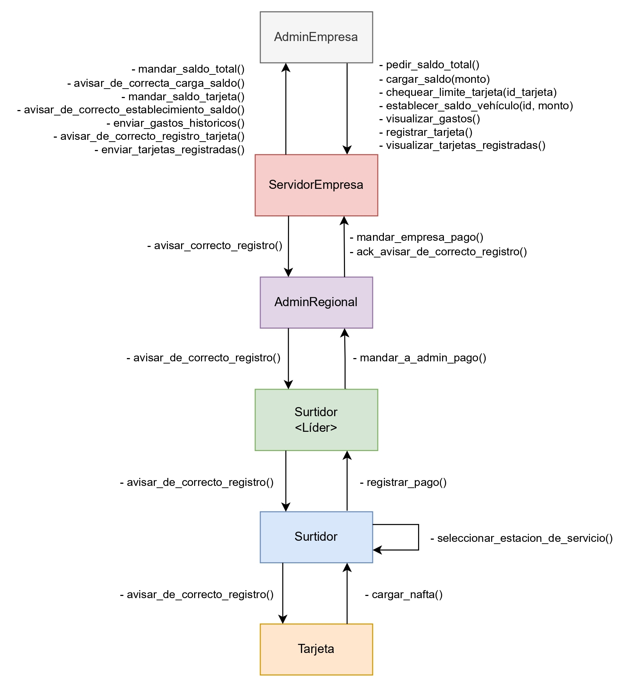

_Figura: Diagrama de actores._

---

### Administrador de Empresa (CompanyAdminActor)

**Finalidad:**
Intermediario entre el usuario administrador y el sistema. Permite establecer límites de tarjetas, cargar saldo, consultar gastos y el límite total de las tarjetas. Se comunica con el CompanyHandler vía TCP.

**Estado Interno:**

```rust
struct CompanyAdminActor {
    reader: Option<OwnedReadHalf>,
    writer: Option<OwnedWriteHalf>,
    company_id: u32,
    sender: mpsc::UnboundedSender<String>,
    reader_task_cancel_token: Option<CancellationToken>,
}
```

**Mensajes Manejados:**

-   `AskTotalBalance`: Solicita el saldo total de la empresa
-   `ChargeBalance { amount: u32 }`: Carga saldo en la cuenta de la empresa
-   `CheckLimit { card_id: String }`: Consulta el límite de una tarjeta específica
-   `EstablishCarBalance { card_id: String, amount: u32 }`: Establece el saldo de una tarjeta
-   `CheckExpenses`: Consulta los gastos de la empresa (los de todas las tarjetas)
-   `TcpIncoming { msg_type: MsgType, payload: Value }`: Recibe respuestas del servidor vía TCP

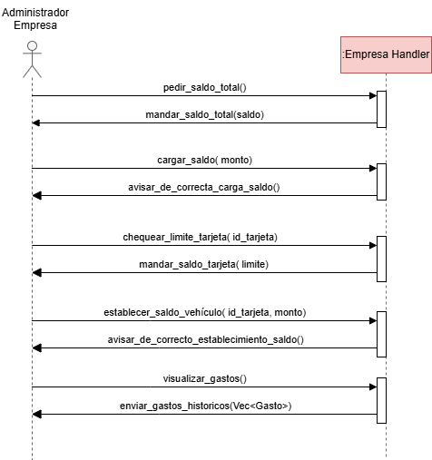

_Figura: Diagrama de flujo del Administrador de Empresa._

---

### Empresa Handler (CompanyHandler)

**Finalidad:**
Gestiona la información de la empresa incluyendo saldo total, tarjetas asociadas y gastos históricos. Recibe gastos del Administrador Regional y a fin de mes se va descontar su saldo con respecto a los gastos. Responde a consultas del Administrador de Empresa. En en un día aleatorio del mes se saldará la cuenta por si quedaron algunos gastos sin pagar.

**Arquitectura de Alta Disponibilidad:**
Cada empresa cuenta con un CompanyHandler primario y un CompanyBackupHandler que actúa como réplica hot-standby. El estado se replica continuamente entre ambos para garantizar tolerancia a fallos.

**Estado Interno:**

```rust
struct CompanyHandler {
    company_id: String,
    reader: Option<OwnedReadHalf>,
    writer: Option<OwnedWriteHalf>,
    registry: Addr<RegistryActor>,
    balance: u32,
    cards: HashMap<u32, Card>, // Card { saldo_actual: u32, gastos_recientes: Vec<Gasto> }
}
```

**Mensajes Manejados:**

-   `AskTotalBalance`: Devuelve el saldo total de la empresa
-   `ChargeBalance { amount: u32 }`: Incrementa el saldo de la empresa
-   `CheckLimit { card_id: String }`: Devuelve el límite/saldo de una tarjeta
-   `EstablishCarBalance { card_id: String, amount: u32 }`: Actualiza el saldo de una tarjeta
-   `CheckExpenses`: Devuelve todos los gastos de la empresa (los de todas las tarjetas)
-   `Disconnect`: Cierra la conexión y detiene el actor

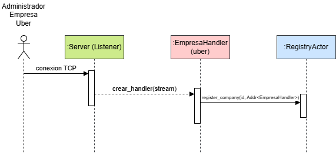

_Figura: Diagrama de flujo del Empresa Handler._

---

### Administrador Regional (RegionalAdmin)

**Finalidad:**
Intermediario entre las estaciones de servicio y las empresas. El sistema implementa múltiples administradores regionales distribuidos para alta disponibilidad. Cada regional admin recibe gastos de los surtidores líderes y los reenvía a las empresas correspondientes. Mantiene conexiones TCP tanto con las estaciones como con las empresas.

**Arquitectura Distribuida:**
Las estaciones de servicio mantienen una lista priorizada de regional admins. En caso de falla de uno, automáticamente se realiza failover al otro regional admin disponible.

**Estado Interno:**

```rust
struct RegionalAdmin {
    address: String,
    id: u32,
    pump_connections: HashMap<String, Addr<RegionalAdminConnectionActor>>,
    company_connections: HashMap<u32, Addr<RegionalAdminConnectionActor>>,
}
```

**Mensajes Manejados:**

-   `PumpExpense { pump_address: String, expense: Expense, connection_actor: Option<Addr<...>> }`: Recibe un gasto de un surtidor y lo reenvía a la empresa correspondiente
-   `CompanyPaymentProcessed { gas_pump_address: String, expense: Expense }`: Recibe confirmación de pago procesado por la empresa
-   `StoreCompanyConnection { company_id: u32, connection: Addr<...> }`: Almacena la conexión a una empresa

---

### Surtidor (Pump)

**Finalidad:**
Atiende pedidos de carga de combustible de las tarjetas utilizando el protocolo **TCP**, estableciendo una conexión persistente con la tarjeta. Los surtidores seguidores envían gastos al líder mediante **QUIC** para comunicación rápida, confiable y encriptada entre surtidores. Implementa el algoritmo Bully para elección de líder usando **UDP** para difusión eficiente de mensajes de elección. El líder consolida gastos y los envía al Administrador Regional vía **TCP**. Puede simular caídas y recuperación.

**Flujo de Procesamiento de Pagos:**
Cuando una tarjeta solicita carga de combustible:

1. La tarjeta se conecta al surtidor disponible (cualquiera, no necesariamente el líder)
2. El surtidor **mantiene la conexión TCP abierta** esperando el resultado del pago
3. Si no es líder, envía el gasto (`PumpMessage::Expense`) al líder vía **QUIC**
4. El líder envía el expense al Regional Admin vía TCP
5. Company procesa el pago y devuelve `PaymentProcessed` vía Regional Admin
6. El mensaje `PaymentProcessedResponse` llega al líder vía TCP
7. Si el líder procesó la solicitud original: responde directamente a la tarjeta
8. Si fue otro pump: el líder reenvía el mensaje al pump que tiene la conexión activa con la tarjeta (usando `card_pump_mapping`)
9. El pump con la conexión envía `FuelComplete` a la tarjeta con el resultado real (accepted/rejected)

**Campos de Coordinación de Respuestas:**

-   `card_response_channels`: HashMap que mapea `card_id` a canales oneshot. Permite que el pump espere asíncronamente la confirmación de pago real antes de responder a la tarjeta
-   `card_pump_mapping`: HashMap que mapea `card_id` al `pump_address` que tiene la conexión TCP con la tarjeta. Usado por el líder para reenviar respuestas de pago al pump correcto

**Estado Interno:**

```rust
struct Pump {
    address: String,
    pumps: HashMap<String, bool>, // puerto, activo
    addr_pumps: HashMap<u32, Addr<Pump>>,
    request_mailbox: VecDeque<RefuelRequest>,
    mailbox_expenses_lider: VecDeque<Expense>,
    buffered_expenses_pump: VecDeque<Expense>,
    is_leader: bool,
    leader_assigned: bool,
    service_station_address: Option<Addr<Pump>>,
    leader_addr: Option<Addr<Pump>>,
    leader_port: Option<u32>,
    listener_started: bool,
    election: Option<LeaderElection>,
    last_election: Option<Instant>,
    self_addr: Option<Addr<Pump>>,
    regional_admin_addrs: Vec<String>,
    current_regional_admin_index: usize,
    regional_admin_connection: Option<Addr<PumpRegionalAdminConnection>>,
    pending_card_results: HashMap<u32, (GasPumpYPFMessage, String)>,
    card_response_channels: HashMap<u32, tokio::sync::oneshot::Sender<bool>>,
    card_pump_mapping: HashMap<u32, String>,
}
```

**Mensajes Manejados:**

-   `TcpFuelRequest { request: FuelRequestData, card_address: String }`: Procesa una solicitud de carga de combustible recibida vía TCP
-   `Expense { company_id: u32, card_id: u32, total: u32, date: String }`: (Solo líder) Recibe y almacena un gasto enviado vía QUIC
-   `PaymentProcessedResponse { accepted: bool, expense: Expense }`: Recibe confirmación de pago desde Regional Admin. Si tiene la conexión con la tarjeta, envía resultado; si es líder, reenvía al pump correcto
-   `StoreCardResponseChannel { card_id: u32, sender: oneshot::Sender<bool> }`: Almacena canal para notificar resultado de pago a conexión TCP esperando
-   `Election { sender_port: u32 }`: Participa en la elección de líder usando algoritmo Bully (UDP)
-   `SetLeader { leader_port: u32 }`: Establece quién es el líder actual
-   `Coordinator { sender_port: u32 }`: Recibe notificación de nuevo coordinador
-   `GetLeaderInfo { requester_port: u32 }`: Devuelve el puerto del líder actual
-   `UpdatePumps { addr_pumps: HashMap<u32, Addr<Pump>> }`: Actualiza la lista de surtidores disponibles
-   `SetAddress { address: String }`: Configura la dirección del surtidor
-   `Start`: Inicia el listener TCP para recibir conexiones de tarjetas
-   `SetSelfAddr { addr: Addr<Pump> }`: Almacena su propia dirección
-   `ExpenseConfirmed { pump_id: usize, state: bool }`: Confirma que un gasto fue procesado
-   `StoreRegionalAdminConnection { connection: Addr<PumpRegionalAdminConnection> }`: Almacena conexión al administrador regional
-   `ConnectToRegionalAdmin`: Conecta o reintenta conexión al administrador regional
-   `SendToRegionalAdmin { msg_type: MsgType, content: RegionalAdminMessage }`: Envía mensaje al administrador regional
-   `TryNextRegionalAdmin { failed_address: String, ... }`: Intenta conectar al siguiente Regional Admin en la lista tras fallo
-   `CrashRecovery`: Maneja recuperación después de una caída simulada
-   `RandomCrashTrigger`: Dispara caídas aleatorias del sistema
-   `GetPendingCardResult { card_id: u32 }`: Consulta si hay resultado pendiente para una tarjeta
-   `RemovePendingCardResult { card_id: u32 }`: Elimina resultado pendiente tras entregarlo
-   `StorePendingCardResult { card_id: u32, result: GasPumpYPFMessage, card_address: String }`: Almacena resultado cuando no se pudo enviar a la tarjeta

---

### Tarjeta Ruta (Card)

**Finalidad:**
Representa la tarjeta de un vehículo que solicita carga de combustible. Se conecta vía TCP a una estación de servicio (surtidor) para enviar solicitudes de carga y recibir confirmaciones.

**Estado Interno:**

```rust
struct Card {
    company_id: u32,
    card_id: u32,
    gas_pump_address: String,
    card_address: String,
    fuel_complete_sender: mpsc::UnboundedSender<FuelComplete>,
    tcp_writer: Option<OwnedWriteHalf>,
    reader_task_cancel_token: Option<CancellationToken>,
}
```

**Mensajes Manejados:**

-   `FuelRequest { data: FuelRequestData }`: Envía una solicitud de carga al surtidor vía TCP
-   `FuelComplete { success: bool }`: Recibe la confirmación de carga (exitosa o fallida)

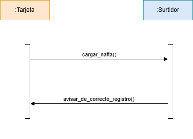

_Figura: Diagrama del flujo Vehiculo._

---

### Estructuras de Datos

**FuelRequestData:**
Datos de una solicitud de carga de combustible.

```rust
struct FuelRequestData {
    company_id: u32,
    card_id: u32,
    liters: u32,
}
```

**Expense (Gasto):**
Representa un gasto registrado en el sistema.

```rust
struct Expense {
    company_id: u32,
    card_id: u32,
    total: u32,
    date: String,
}
```

**Card (en CompanyHandler):**
Información de una tarjeta asociada a una empresa.

```rust
struct Card {
    saldo_actual: u32,
    gastos_recientes: Vec<Gasto>,
}
```

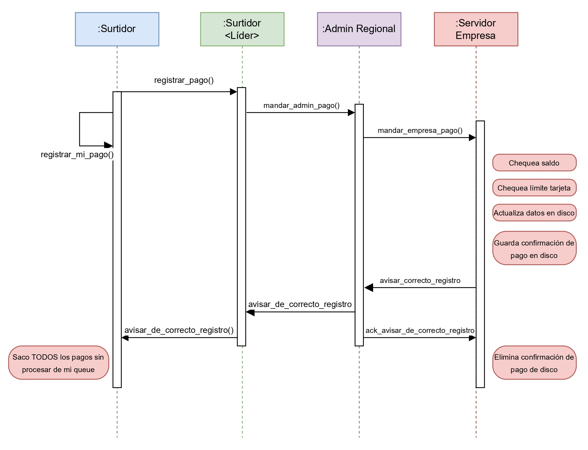

_Figura: Diagrama de Flujo Registro Gasto._

---

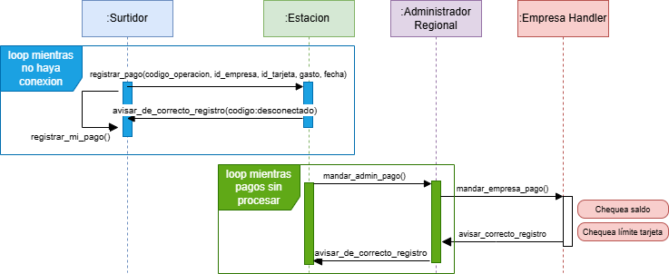

_Figura: Diagrama de Flujo Registro Gasto cuando Estacion de Servicio esta desconectada._

---

## Casos de Interés

A continuación se describen los comportamientos implementados y las medidas de tolerancia a fallos ante la caída momentánea de distintos nodos del sistema.

1. **Tarjeta (Card)**

    - **Comportamiento:** Si la tarjeta pierde conexión momentáneamente durante una operación, no podrá completar la carga hasta restaurarse la conectividad.
    - **Acción:** La operación debe reintentarse desde el cliente (tarjeta). El actor Card maneja la conexión TCP con el surtidor y espera confirmación vía `FuelComplete`.

2. **Surtidor (Pump)**

    - **Comportamiento:** Cuando una tarjeta solicita carga vía TCP, la solicitud se procesa directamente en el surtidor que recibe la conexión. El surtidor reenvía el gasto al líder mediante **QUIC** (comunicación encriptada entre pumps). Si el líder no responde, se detecta la falla.
    - **Acción Implementada:**
        -   Se implementan timeouts en la comunicación con el líder
        -   QUIC proporciona entrega confiable con encriptación TLS 1.3
        -   Al detectar falla del líder, cualquier surtidor puede disparar una elección usando UDP
        -   Los gastos pendientes se mantienen en `buffered_expenses_pump` hasta que haya un nuevo líder
        -   Una vez elegido el nuevo líder, los gastos pendientes se reenvían automáticamente vía QUIC mediante `recover_pending_expenses()`

3. **Surtidor Líder (Estación de Servicio)**

    - **Comportamiento - Caída del Líder:**
        - El líder puede simular caídas con 30% de probabilidad al procesar gastos (método `should_crash()`)
        - Antes de detenerse, el líder difunde un mensaje de falla (`Election { sender_port: 0 }`) a todos los surtidores mediante `broadcast_leader_failure()` usando UDP
        - Los surtidores detectan la falla y disparan una elección usando el algoritmo Bully sobre UDP
    - **Acción Implementada:**
        - Elección de líder mediante algoritmo Bully implementado en `LeaderElection` usando UDP
        - El surtidor con mayor ID se convierte en el nuevo líder
        - Los surtidores que tenían gastos pendientes los reenvían al nuevo líder
        - Estado de elección incluye: `election_in_progress`, `leader_elected`, timeouts de 500ms (TIMEOUT constante)
        - Mensajes de elección: `Election`, `OK`, `Coordinator` enviados por UDP
        - Una vez elegido, el nuevo líder comienza a recibir gastos en `mailbox_expenses_lider`
        - Se evita spam de elecciones mediante debouncing temporal (`last_election`)

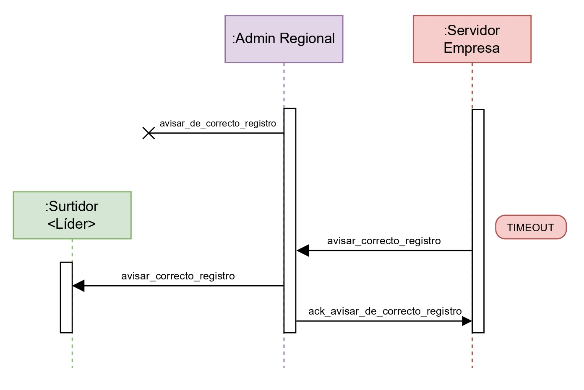

_Figura: Diagrama de flujo de tolerancia a fallos cuando el Surtidor Líder se cae y el Admin Regional no puede mandarle la confirmación de pago._

---

4. **Administrador Regional (RegionalAdmin)**

    - **Comportamiento:** El sistema implementa múltiples administradores regionales distribuidos. Si un regional admin deja de estar disponible, las estaciones automáticamente failover al siguiente regional admin disponible en su lista.
    - **Acción Implementada:**
        - Cada estación mantiene lista de regional admins
        - Ante fallo, cambio automático al siguiente regional admin disponible
        - Reenvío automático de gastos buffereados una vez conectado al nuevo regional

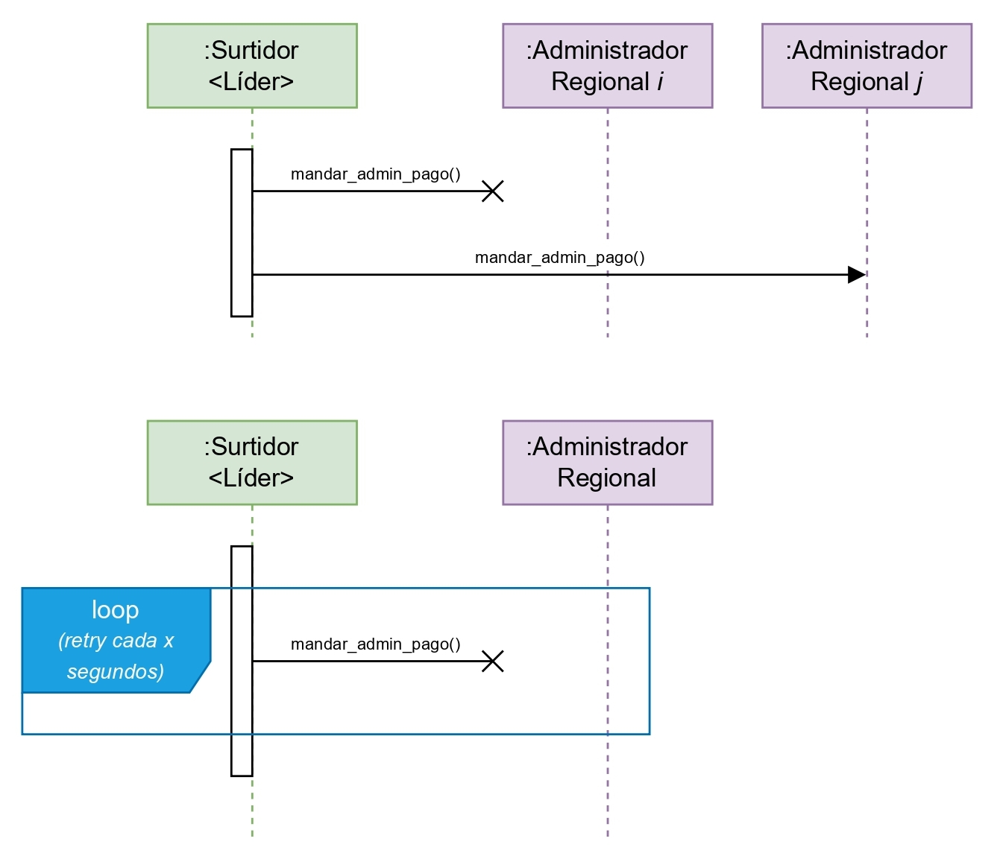

_Figura: Diagrama de flujo de tolerancia a fallos cuando el Administrador Regional se cae (perspectiva del Surtidor Líder)._

---

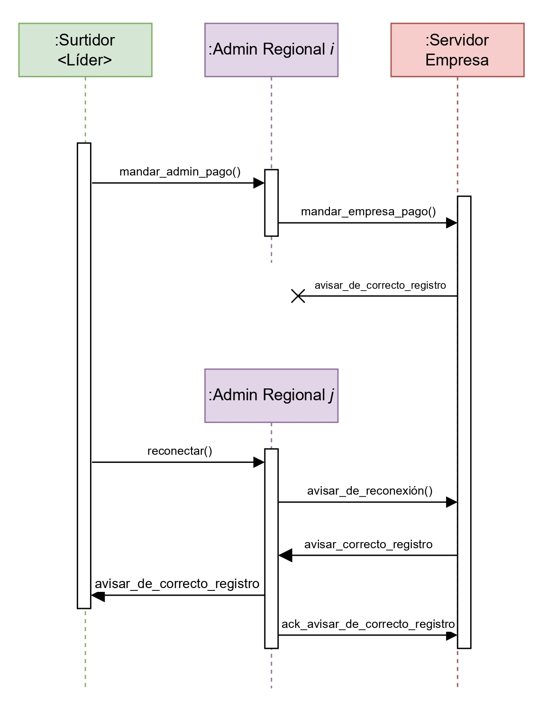

_Figura: Diagrama de flujo de tolerancia a fallos cuando el Administrador Regional se cae (perspectiva del Servidor)._

---

5. **Empresa Handler (CompanyHandler)**

    - **Comportamiento:** Réplica de respaldo (hot standby) con replicación de estado (balance, cards, gastos).
    - **Acción:** Mientras el primario está activo, los mensajes entrantes se encolan en el handler principal; ante fallo, se promueve la réplica y reencamina la cola.

6. **Administrador de Empresa (CompanyAdminActor)**
    - **Comportamiento:** Actor cliente que permite al administrador interactuar con el sistema. Su indisponibilidad no afecta el procesamiento de gastos.
    - **Acción:** Las operaciones administrativas se pueden reintentar cuando el administrador vuelva a estar disponible. El actor gestiona timeouts y reconexiones de forma automática. Se conecta automáticamente al handler activo (primario o backup promocionado).

---

## Protocolo de Comunicación

El sistema utiliza el patrón de actores de Actix para comunicación entre componentes. Cada actor:

-   Tiene una dirección (`Addr<T>`) que permite enviarle mensajes
-   Procesa un mensaje a la vez, asegurando exclusión mutua implícita (mailbox)
-   Se comunica de manera asíncrona (no bloqueante)

### Protocolos de Red Implementados

El sistema utiliza diferentes protocolos según las necesidades de cada tipo de comunicación:

**TCP (Transmission Control Protocol):**

-   **Card ↔ Pump (Surtidor):**
    -   Tarjetas se conectan a surtidores vía TCP para enviar solicitudes de carga (`FuelRequest`)
    -   Surtidores responden con confirmación de carga (`FuelComplete`)
    -   Conexión persistente que se mantiene abierta hasta recibir respuesta de pago
    -   Implementado con `TCPProtocol::send_with_writer` y handshake de reconexión
-   **Pump Leader ↔ Regional Admin:**
    -   Surtidores líderes se conectan a Administradores Regionales para enviar gastos consolidados
    -   Handshake inicial: `"PUMP <address> <service_station_id>\n"`
    -   Mensajes: `PumpExpense` (pump → regional), `PaymentProcessed` (regional → pump)
    -   Conexión manejada por `PumpRegionalAdminConnection` actor
    -   TCP keep-alive configurado (60s idle, 10s interval) para prevenir timeouts
-   **Regional Admin ↔ Company:**
    -   Administradores Regionales se conectan al servidor central de la empresa
    -   Handshake: `"REGIONAL <id>\n"`
    -   Bidireccional: envío de expenses y recepción de confirmaciones
-   **Company Admin ↔ Company:**
    -   Administradores de empresa se conectan para consultas y gestión
    -   Handshake: `"COMPANY <id>\n"`
    -   Consultas de saldo, límites, gastos, y operaciones administrativas

**UDP (User Datagram Protocol):**

-   **Elección de Líder (Algoritmo Bully):**
    -   Comunicación entre surtidores para mensajes de elección: `Election`, `OK`, `Coordinator`
    -   Implementado en `LeaderElection` (`common/src/leader_election.rs`)
    -   Socket vinculado a dirección de control: `127.0.0.1:<port>` donde port es el ID del surtidor
    -   Sin estado de conexión - cada mensaje es independiente
    -   Timeout de 1 segundo para respuestas de elección
-   **Ventajas para elección:**
    -   Mínima latencia para mensajes de control
    -   Broadcast eficiente a múltiples peers simultáneamente
    -   Implementación simple del algoritmo Bully

**QUIC (Quick UDP Internet Connections):**

-   **Follower Pump → Leader Pump:**
    -   Surtidores seguidores envían gastos al líder usando QUIC (`PumpMessage::Expense`)
    -   Puerto QUIC: puerto base del surtidor + 100 (ej: pump en 10030 escucha QUIC en 10130)
    -   Streams unidireccionales para envío de gastos
    -   Encriptación TLS 1.3 automática
    -   Implementado con `Pump::send_quic_message_to_pump()`
-   **Mensajes pump-to-pump vía QUIC:**
    -   `PumpMessage::Expense`: Envío de gasto al líder
    -   `PumpMessage::Election`: Mensajes de elección (experimental)
    -   `PumpMessage::Coordinator`: Anuncios de coordinador (experimental)
    -   `PumpMessage::LeaderFailure`: Notificaciones de fallo de líder
-   **Ventajas:**
    -   Multiplexación de streams sin head-of-line blocking
    -   Encriptación integrada (seguridad entre surtidores)
    -   Menor latencia vs TCP para mensajes pequeños
    -   Recuperación rápida de pérdida de paquetes

**Actix Messages (In-Memory):**

-   **Mensajes internos del pump:**
    -   `UpdatePumps`: Actualiza lista de surtidores disponibles
    -   `SetLeader`: Notifica nuevo líder elegido
    -   `ExpenseConfirmed`: Confirma procesamiento de gasto
    -   `Coordinator`: Anuncia nuevo coordinador tras elección
    -   Usados para comunicación dentro del mismo proceso actor

### Formato de Mensajes TCP

Cada mensaje TCP sigue este formato:

1. **1 byte**: Código de operación (`MsgType` enum serializado como u8)
2. **4 bytes**: Longitud del payload (big-endian u32)
3. **N bytes**: Payload serializado como JSON (serde_json)

**Tipos de mensaje (MsgType):**

-   `FuelRequest` (0): Solicitud de carga de combustible
-   `FuelComplete` (1): Confirmación de carga completada
-   `PumpExpense` (2): Gasto enviado desde surtidor al regional
-   `PaymentProcessed` (3): Confirmación de pago procesado
-   `AskTotalBalance` (10): Consultar saldo total
-   `ChargeBalance` (11): Cargar saldo
-   `CheckLimit` (12): Consultar límite de tarjeta
-   `EstablishCarBalance` (13): Establecer saldo de tarjeta
-   `CheckExpenses` (14): Consultar gastos de la empresa

### Formato de Mensajes UDP (Elección de Líder)

Los mensajes de elección se envían a través de UDP:

**Estructura del mensaje:**

1. **1 byte**: Tipo de mensaje (Election = 'E', OK = 'O', Coordinator = 'C')
2. **8 bytes**: ID del emisor (usize serializado)

**Características del protocolo UDP en elección:**

-   **Simplicidad:** Mensajes pequeños y rápidos sin overhead de conexión
-   **Broadcast eficiente:** Permite notificar a múltiples peers simultáneamente
-   **Timeout optimizado:** 1 segundo configurado en `LeaderElection::TIMEOUT`
-   **Sin garantías:** El algoritmo Bully maneja pérdida de mensajes mediante timeouts y reintentos
-   **Estado en memoria:** Cada pump mantiene estado de elección local

### Serialización

-   **TCP**: JSON mediante `serde_json` para mensajes de datos (requests, responses, expenses)
-   **UDP**: Formato binario simple para mensajes de elección
    -   Header de 1 byte (tipo) + ID de 8 bytes
    -   Mínimo overhead para máxima velocidad
-   **Actix**: Mensajes nativos de Rust sin serialización (comunicación in-memory)
-   Las estructuras de datos implementan `Serialize` y `Deserialize` de Serde cuando es necesario

### Ciclo de Vida de Conexiones

**TCP:**

-   Conexiones persistentes mantenidas durante toda la sesión
-   Cada conexión manejada por un actor dedicado (`RegionalAdminConnectionActor` para regional admin)
-   Handshake inicial: `"COMPANY <id>\n"` o `"REGIONAL <id>\n"` o `"PUMP <address> <station_id>\n"`
-   Lectura/escritura asíncrona mediante `OwnedReadHalf` y `OwnedWriteHalf`
-   Tareas de lectura en background usando `tokio::spawn`
-   Cancelación limpia mediante `CancellationToken` en `Card`
-   TCP Keep-alive configurado (60s idle, 10s interval) para prevenir timeouts bajo carga

**UDP:**

-   Socket vinculado a dirección de control basada en ID del surtidor
-   Sin estado de conexión - cada mensaje es independiente
-   Binding persistente para recibir mensajes de elección
-   Envío directo a direcciones de peers conocidas

### Descubrimiento y Conexión

1. **Tarjetas → Surtidores:** Las tarjetas se conectan a una dirección de estación de servicio conocida

2. **Surtidores → Regional Admin:** Los surtidores conocen la dirección del administrador regional (pasada en la inicialización via `regional_admin_addr`)

3. **Admin Empresa → CompanyHandler:** Se conecta al servidor central en `COMPANY_LEADER_PORT`

4. **Regional Admin → CompanyHandler:** Se conecta al servidor central en `COMPANY_LEADER_PORT` y realiza handshake

5. **Surtidores entre sí:** Se conocen mutuamente mediante `UpdatePumps` que distribuye el `HashMap<u32, Addr<Pump>>`

---

## Mensajes Inter-Actor

Esta tabla muestra los flujos de mensajes entre actores siguiendo la convención: **se usa el nombre del mensaje del actor receptor**.

| **Emisor**               | **Receptor**             | **Mensaje Receptor**                                                | **Protocolo**          | **Descripción**                                               |
| :----------------------- | :----------------------- | :------------------------------------------------------------------ | :--------------------- | :------------------------------------------------------------ |
| **Card**                 | **Pump**                 | `TcpFuelRequest { request: FuelRequestData, card_address: String }` | TCP                    | Solicita carga de combustible con litros especificados        |
| **Pump**                 | **Card**                 | `FuelComplete { success: bool }`                                    | TCP                    | Confirma si la carga fue exitosa o falló                      |
| **Pump**                 | **Pump (líder)**         | `PumpMessage::Expense(expense)`                                     | QUIC                   | Surtidor envía gasto al líder para registro                   |
| **Pump**                 | **Pump**                 | `Election { sender_port: u32 }`                                     | UDP                    | Inicia proceso de elección de líder (Bully)                   |
| **Pump**                 | **Pump**                 | `SetLeader { leader_port: u32 }`                                    | Actix                  | Notifica el nuevo líder elegido                               |
| **Pump**                 | **Pump**                 | `Coordinator { sender_port: u32 }`                                  | Actix                  | Anuncia que el emisor es el nuevo coordinador                 |
| **Pump**                 | **Pump**                 | `UpdatePumps { addr_pumps: HashMap<...> }`                          | Actix                  | Actualiza la lista de surtidores disponibles                  |
| **Pump**                 | **Pump**                 | `ExpenseConfirmed { pump_id, state }`                               | Actix                  | Confirma que un gasto fue procesado por el líder              |
| **Pump (líder)**         | **RegionalAdmin**        | `PumpExpense { pump_address, expense, connection_actor }`           | TCP                    | Reporta gasto al administrador regional                       |
| **RegionalAdmin**        | **CompanyHandler**       | `PaymentProcessedAck { pump_address, expense }`                     | TCP (via SendToClient) | Confirma que el pago fue procesado                            |
| **RegionalAdmin**        | **Pump**                 | `CompanyPaymentProcessed { pump_address, expense }`                 | TCP (via SendToClient) | Reenvía confirmación de pago al surtidor                      |
| **CompanyHandler**       | **RegionalAdminHandler** | `StoreRegionalAdminHandler { regional_admin_id, handler }`          | Actix                  | Almacena handler del Regional Admin para envío de respuestas  |
| **CompanyHandler**       | **RegionalAdminHandler** | `SendPaymentProcessed { pump_address, expense, accepted }`          | Actix                  | Solicita envío de PaymentProcessed al Regional Admin vía TCP  |
| **RegionalAdminHandler** | **RegionalAdmin**        | `PaymentProcessed { pump_address, expense, accepted }`              | TCP                    | Envía confirmación de pago procesado                          |
| **CompanyAdminActor**    | **CompanyHandler**       | `AskTotalBalance`                                                   | TCP                    | Solicita saldo total de la empresa                            |
| **CompanyAdminActor**    | **CompanyHandler**       | `ChargeBalance { amount: u32 }`                                     | TCP                    | Carga saldo en la cuenta de la empresa                        |
| **CompanyAdminActor**    | **CompanyHandler**       | `CheckLimit { card_id: String }`                                    | TCP                    | Consulta límite de una tarjeta                                |
| **CompanyAdminActor**    | **CompanyHandler**       | `EstablishCarBalance { card_id, amount }`                           | TCP                    | Establece saldo de una tarjeta                                |
| **CompanyAdminActor**    | **CompanyHandler**       | `CheckExpenses`                                                     | TCP                    | Consulta los gastos de la empresa (los de todas las tarjetas) |
| **CompanyHandler**       | **CompanyAdminActor**    | `TcpIncoming { msg_type, payload }`                                 | TCP                    | Responde con datos solicitados (saldo, límites, gastos)       |
| **Server**               | **CompanyHandler**       | (spawn)                                                             | TCP                    | Crea nuevo CompanyHandler al aceptar conexión                 |
| **CompanyHandler**       | **RegistryActor**        | `RegisterCompany { company_id, addr }`                              | Actix                  | Registra la empresa en el registro central                    |

---

# Diagramas de threads y procesos

En esta sección se muestran los diagramas que ilustran la organización de hilos y procesos en los distintos componentes del sistema y el flujo de inicialización del servidor.

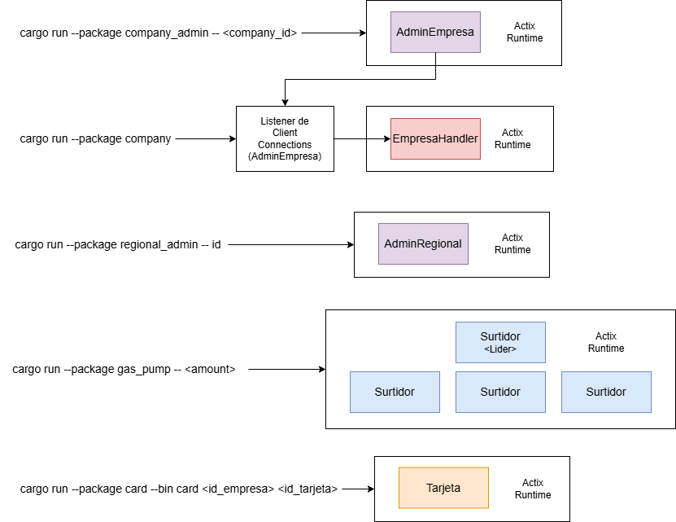

_Figura: Diagrama de threads y procesos._

---

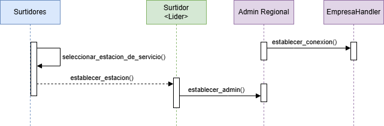

_Figura: Diagrama de flujo de inicializacion del server._

---

# Mejoras

## Posibles mejoras de esta implementación

A continuación se detallan mejoras potenciales que podrían implementarse para optimizar el rendimiento, escalabilidad y robustez del sistema:

### **Procesamiento en Chunks de Gastos**

-   **Problema actual:** Los gastos se envían individualmente desde la Estación de Servicio al Administrador Regional, generando múltiples operaciones de I/O y overhead de red.
-   **Mejora propuesta:** Agrupar pagos en bloques (chunks) antes de enviarlos, reduciendo el número de mensajes y optimizando el ancho de banda.

### **Sistema Distribuido de Servidores Company**

-   **Problema actual:** El servidor central (`CompanyHandler`) representa un punto único de falla (SPOF - Single Point of Failure). Aunque se implementa persistencia en disco y reconexión automática, si el servidor central cae completamente, todo el sistema se detiene hasta que se recupere.
-   **Mejora propuesta:** Implementar un sistema de servidores distribuidos con un back up por empresa.

### **Notificaciones a Company Admin en Patrón Productor-Consumidor**

-   **Problema actual:** El `CompanyAdminActor` recibe notificaciones del `CompanyHandler` a través de un canal simple de mensajes TCP. Cuando hay alta carga de transacciones, las notificaciones pueden saturar el canal o perderse si el admin está temporalmente desconectado.
-   **Mejora propuesta:** Implementar un sistema de notificaciones asíncronas usando patrón productor-consumidor.

---

## Mejoras frente al diseño original

Esta sección detalla los cambios implementados respecto al diseño original propuesto, explicando las razones y beneficios de cada modificación:

### 1. **Simplificación de la Arquitectura de Actores**

**Diseño Original:**

-   Existían actores separados para `TerminalYPF` y `EstacionDeServicio`
-   La `TerminalYPF` delegaba pedidos a surtidores disponibles
-   La `EstacionDeServicio` era representada como un `Surtidor (Líder)`

**Implementación Actual:**

-   Se eliminó el actor `TerminalYPF` como entidad separada
-   Los surtidores manejan directamente las solicitudes de carga a través del líder
-   El surtidor líder asume las responsabilidades de coordinación que tenía la terminal

**Razones del cambio:**

-   `TerminalYPF` implicaba un _Single Point Of Failure_.
-   Eliminación de un nivel innecesario de indirección
-   Reducción de complejidad en el flujo de mensajes
-   Menor overhead de comunicación entre actores

### 2. **Modelo de Registro Centralizado**

**Diseño Original:**

-   No se especificaba claramente un mecanismo de registro centralizado
-   Cada actor mantenía referencias directas a otros actores

**Implementación Actual:**

-   `RegistryActor` centralizado que mantiene mapeos de:
    -   `company_id` → `CompanyHandler address` (primario y backup)
    -   `regional_admin_id` → `RegionalAdmin address`
    -   `pump_id` → `Pump address`
-   Todos los actores se registran al inicializarse
-   Soporte para múltiples handlers por empresa (primario/backup)
-   Actualización dinámica ante promoción de backups

**Razones del cambio:**

-   Necesidad de descubrimiento dinámico de actores
-   Facilitar tolerancia a fallos y recuperación
-   Simplificar el enrutamiento de mensajes

### 3. **Manejo de Gastos y Buffering**

**Diseño Original:**

-   Buffering local en `EstacionDeServicio` cuando está desconectada
-   Envío individual de gastos al `AdminRegional`

**Implementación Actual:**

-   Cada `Pump` (surtidor) mantiene buffer local de gastos
-   El líder consolida y envía gastos al `RegionalAdmin`
-   `RegionalAdmin` buffera gastos si un `CompanyHandler` está caído

**Razones del cambio:**

-   Mayor resiliencia ante fallos de red
-   Prevenir pérdida de datos de transacciones
-   Mejor distribución de responsabilidades

### 4. **Sistema de Garantía de Entrega con Persistencia y Buffering**

**Diseño Original:**

-   No se especificaba un mecanismo formal de garantía de entrega
-   Sin persistencia de mensajes en tránsito

**Implementación Actual:**

El sistema implementa una arquitectura de tres capas para garantizar la entrega de mensajes `PaymentProcessed` desde Company hacia Pumps, incluso ante fallos de red o caídas de componentes:

#### **Capa 1: Company (Persistencia Durable)**

-   **Persistencia en JSON** del estado completo de la empresa en disco (`data/<company_id>.json`)
-   **HashMap de confirmaciones pendientes** (`pending_confirmations`) persiste junto con balance y tarjetas
-   Cada confirmación pendiente incluye: `pump_address`, `expense`, `accepted`, `timestamp`, `retry_count`
-   **Carga automática** del estado al iniciar (incluyendo confirmaciones pendientes)
-   **Reintento periódico** cada 5 segundos de confirmaciones pendientes (máx. 10 reintentos)
-   **Persistencia inmediata** tras cada cambio de estado (nueva confirmación o incremento de retry_count)

**Estructura de PendingConfirmation:**

```rust
struct PendingConfirmation {
    pump_address: String,
    expense: Expense,
    accepted: bool,
    timestamp: u64,      // Unix timestamp en segundos
    retry_count: u32,    // Contador de reintentos
    regional_admin_id: String,  // ID del Regional Admin que envió el expense
}
```

**Clave única de confirmación:**

```
"{pump_address}:{company_id}:{card_id}:{total}:{date}"
```

**Flujo de persistencia:**

1. Company procesa expense (`ProcessPumpExpense`)
2. **Antes** de enviar: Crea `PendingConfirmation` con `retry_count=0`
3. Agrega al HashMap `pending_confirmations` con clave única
4. **Persiste estado completo** a JSON en disco
5. Envía mensaje `PaymentProcessed` al RegionalAdmin vía `RegionalAdminHandler`
6. Al recibir `PaymentProcessedAck` del RegionalAdmin: Remueve de `pending_confirmations` y persiste
7. Cada 5 segundos: Reintenta confirmaciones pendientes (incrementa `retry_count`, actualiza `timestamp`)

#### **Capa 2: RegionalAdmin (Buffer en Memoria)**

-   **Stateless por diseño:** No persiste datos en disco
-   **Buffer temporal** para mensajes cuando la conexión al Pump está caída
-   **Estructura:** `HashMap<String, Vec<PendingMessage>>` indexado por `pump_address`

**PendingMessage:**

```rust
struct PendingMessage {
    msg_type: MsgType,
    message: PendingMessageType, // Enum con PaymentProcessed, etc.
    timestamp: u64,
}
```

**Lógica de buffering:**

-   Se buffera mensaje si:
    1. **Connection actor no establecido:** `pump_connections.get(pump_address).is_none()` al recibir `CompanyPaymentProcessed`
    2. **Falla envío TCP:** `TCPProtocol::send_with_writer()` retorna error, el `ConnectionActor` envía `SendToPumpFailed` que buffera y remueve conexión rota
-   **Almacenamiento de conexión:** Al recibir `PumpExpense` con `connection_actor`, lo almacena en `pump_connections` si no existe
-   **Reintento periódico:** Cada 5 segundos (vía `run_interval`) verifica pumps reconectados y reenvía mensajes bufferados
-   **Reenvío en reconexión:** Al almacenar nueva conexión para un pump, entrega inmediatamente todos los mensajes pendientes para ese pump
-   **ACK a Company:** Solo envía `PaymentProcessedAck` tras confirmación exitosa (`SendToPumpSuccess`)
-   **Sin re-buffering:** Si un mensaje ya está bufferado, no se vuelve a bufferar en reintentos

**Notificaciones de falla/éxito:**

-   `SendToPumpFailed { pump_address, msg_type, expense, accepted }`: Notifica al RegionalAdmin cuando:
    -   El writer TCP no está disponible (`writer.is_none()`)
    -   El envío TCP falla (`TCPProtocol::send_with_writer` retorna error)
    -   Buffera el mensaje y remueve la conexión rota de `pump_connections`
-   `SendToPumpSuccess { pump_address, expense }`: Notifica al RegionalAdmin tras envío TCP exitoso
    -   RegionalAdmin envía `PaymentProcessedAck` a Company solo tras recibir este mensaje

#### **Capa 3: Pump (Procesamiento de Confirmaciones)**

-   **Buffer local de expenses** (`buffered_expenses_pump`) antes de enviar al líder
-   **Mailbox de expenses en el líder** (`mailbox_expenses_lider`) recibe expenses de todos los pumps
-   **Recepción de PaymentProcessed:** El pump recibe confirmación del RegionalAdmin vía TCP
-   **Procesamiento simple:** No implementa deduplicación explícita actualmente
-   **Respuesta al RegionalAdmin:** Confirma recepción de `PaymentProcessed`

**Limitaciones conocidas:**

-   **No hay deduplicación en Pump:** Mensajes reenviados múltiples veces podrían procesarse duplicadamente
-   **Max 10 reintentos:** Confirmaciones que superan este límite se registran en logs pero no se eliminan del estado persistido
-   **Intervalo de reintento fijo:** Company reintenta cada 5 segundos (configurable vía constante `RETRY_INTERVAL_SECS`)
